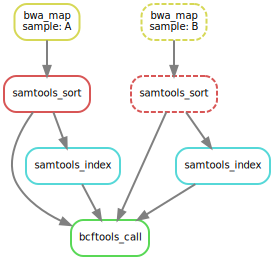

Test of the `snakemake` with `singularity` image [tutorial]( https://snakemake.readthedocs.io/en/stable/tutorial/setup.html#running-the-tutorial-on-your-local-machine) on my local machine and on HPC ([genotoul](http://bioinfo.genotoul.fr/)).

# Summary

*Everything is developed below.*

1. Data
    1. Get it `wget https://github.com/snakemake/snakemake-tutorial-data/archive/v5.24.1.tar.gz`
    1. Uncompress `tar --wildcards -xf v5.24.1.tar.gz --strip 1 "*/data"`
1. Singularity
    1. Write an environment file [`img/environment.yml`](https://github.com/sylvainschmitt/snakemake_singularity/blob/main/img/environment.yml)
    1. Write a singularity definition [`img/sing.def`](https://github.com/sylvainschmitt/snakemake_singularity/blob/main/img/sing.def)
    1. build the image `sudo singularity build snakemake_tuto.sif sing.def`
1. Snakemake
    1. Create a Snakefile workflow with the configuration [`config.yml`](https://github.com/sylvainschmitt/snakemake_singularity/blob/main/config.yml) and the pipeline [`Snakefile`](https://github.com/sylvainschmitt/snakemake_singularity/blob/main/Snakefile)
    1. Add the needed scripts [`scripts/plot_quals.py`](https://github.com/sylvainschmitt/snakemake_singularity/blob/main/scripts/plot_quals.py) 
    1. *Run locally if not HPC `snakemake --use-singularity`*
1. HPC
    1. Create the script [`job.sh`](https://github.com/sylvainschmitt/snakemake_singularity/blob/main/job.sh) 
    1. Create the cluster config file [`cluster.json`](https://github.com/sylvainschmitt/snakemake_singularity/blob/main/cluster.json) 
    1. Run the job `sbatch job.sh`

# Setup

## Requirements

* [x] [Singularity](https://github.com/hpcng/singularity/blob/master/INSTALL.md)
* [x] Python ≥3.5 `sudo apt-get install python3.5`
* [x] Snakemake ≥5.24.1 `sudo apt install snakemake`
* [x] BWA 0.7 `sudo apt-get install bwa`
* [x] SAMtools 1.9 `sudo apt-get install samtools`
* [x] Pysam 0.15 `pip install pysam`
* [x] BCFtools 1.9 `sudo apt-get install bcftools`
* [x] Graphviz 2.42 `pip install Graphviz`
* [x] Jinja2 2.11 `pip install Jinja2`
* [x] NetworkX 2.5 `pip install NetworkX`
* [x] Matplotlib 3.3 `pip install Matplotlib`

<!-- ## Installing Mambaforge -->

<!-- ```{bash, eval=F, echo=T} -->
<!-- cd ~/Téléchargements -->
<!-- wget https://github.com/conda-forge/miniforge/releases/latest/download/Mambaforge-Linux-x86_64.sh -->
<!-- bash Mambaforge-Linux-x86_64.sh -->
<!-- ``` -->

## Data

```{bash, eval=F, echo=T}
wget https://github.com/snakemake/snakemake-tutorial-data/archive/v5.24.1.tar.gz
tar --wildcards -xf v5.24.1.tar.gz --strip 1 "*/data" "*/environment.yaml"
rm *.tar.gz*
```

Vizualise obtained data.

```{bash, comment=NA}
tree data
```

## Conda

Write `img/environment.yml`:

```{python, eval=F}
rule bwa_map:
    input:
        "data/genome.fa",
        "data/samples/A.fastq"
    output:
        "mapped_reads/A.bam"
    shell:
        "bwa mem {input} | samtools view -Sb - > {output}"
```

test:

```{bash, eval=F}
conda env create -n myEnv -f environment.yml
conda activate myEnv
conda env list
```

Useful commands list :

* conda env create (with yml file)
* conda activate
* conda deactivate
* conda remove --name myEnv --all (remove select environment)
* conda create
* conda list (package list)
* conda env list (conda envs list)

When envs are created they are automatically create in the folder /home/user/anaconda3/envs/ . You can change the path with the argument --prefix, it can be useful if you want to create an environment specific to a project.
Useful links :
https://docs.conda.io/projects/conda/en/latest/user-guide/tasks/manage-environments.html

## Singularity container

Write `img/sing.def`:

```{python, eval=F}
Bootstrap : docker
From :  continuumio/miniconda3
IncludeCmd : yes

%files
environment.yml

%post
apt-get update && apt-get install -y procps && apt-get clean -y
/opt/conda/bin/conda env create -n myEnv -f /environment.yml 
/opt/conda/bin/conda clean -a


%environment
export PATH=/opt/conda/bin:$PATH
. /opt/conda/etc/profile.d/conda.sh
conda activate myEnv

%runscript
echo "Hello World"

%help
Tools for Snakemake tutorial

%labels
Author Sylvain SCHMITT
```

build:

```{bash, eval=F}
sudo singularity build snakemake_tuto.sif sing.def
```

<!-- ## Creating an environment with the required software -->

<!-- **Slow with bad internet connection!** -->

<!-- ```{bash, eval=F, echo=T} -->
<!-- conda activate base -->
<!-- mamba env create --name snakemake-tutorial --file environment.yaml -->
<!-- ``` -->

<!-- ## Activating the environment -->

<!-- ```{bash, eval=F} -->
<!-- conda activate snakemake-tutorial -->
<!-- snakemake --help -->
<!-- ``` -->

<!-- To stop it (not now): -->

<!-- ```{bash, eval=F} -->
<!-- conda deactivate -->
<!-- ``` -->

# Basics

## Mapping reads

Write `Snakefile`:

```{python, eval=F}
rule bwa_map:
    input:
        "data/genome.fa",
        "data/samples/A.fastq"
    output:
        "mapped_reads/A.bam"
    shell:
        "bwa mem {input} | samtools view -Sb - > {output}"
```

dry run:

```{bash, eval=F}
snakemake -np mapped_reads/A.bam
```

test:

```{bash, eval=F}
snakemake --cores 1 mapped_reads/A.bam
```

## Generalizing the read mapping rule

```{python, eval=F}
rule bwa_map:
    input:
        "data/genome.fa",
        "data/samples/{sample}.fastq"
    output:
        "mapped_reads/{sample}.bam"
    shell:
        "bwa mem {input} | samtools view -Sb - > {output}"
```

dry run:

```{bash, eval=F}
snakemake -np mapped_reads/B.bam
snakemake -np mapped_reads/A.bam mapped_reads/B.bam
snakemake -np mapped_reads/{A,B}.bam
```

`snakemake` is not producing `A.bam` as already done. Test the follwongin and rerun dry run:

```{bash, eval=F}
touch data/samples/A.fastq
```

## Sorting read alignments

Add to `Snakefile`:

```{python, eval=F}
rule samtools_sort:
    input:
        "mapped_reads/{sample}.bam"
    output:
        "sorted_reads/{sample}.bam"
    shell:
        "samtools sort -T sorted_reads/{wildcards.sample} "
        "-O bam {input} > {output}"
```

dry run:

```{bash, eval=F}
snakemake -np sorted_reads/B.bam
```

## Indexing read alignments and visualizing the DAG of jobs

Add to `Snakefile`:

```{python, eval=F}
rule samtools_index:
    input:
        "sorted_reads/{sample}.bam"
    output:
        "sorted_reads/{sample}.bam.bai"
    shell:
        "samtools index {input}"
```

see dag:

```{bash, eval=F}
snakemake --dag sorted_reads/{A,B}.bam.bai | dot -Tsvg > dag/dag1.svg
```

```{r}
knitr::include_graphics("dag/dag1.svg")
```

*Dashed frames are already done.*

## Calling genomic variants

Add to top of `Snakefile`:

```{python, eval=F}
SAMPLES = ["A", "B"]
```

Add to `Snakefile`:

```{python, eval=F}
rule bcftools_call:
    input:
        fa="data/genome.fa",
        bam=expand("sorted_reads/{sample}.bam", sample=SAMPLES),
        bai=expand("sorted_reads/{sample}.bam.bai", sample=SAMPLES)
    output:
        "calls/all.vcf"
    shell:
        "samtools mpileup -g -f {input.fa} {input.bam} | "
        "bcftools call -mv - > {output}"
```

```{bash, eval=F}
snakemake --dag calls/all.vcf | dot -Tsvg > dag/dag2.svg
```

```{r}

```

## Using custom scripts

Add to `Snakefile`:

```{python, eval=F}
rule plot_quals:
    input:
        "calls/all.vcf"
    output:
        "plots/quals.svg"
    script:
        "scripts/plot-quals.py"
```

Write `scripts/plots-qual.py`:

```{python, eval=F}
import matplotlib
matplotlib.use("Agg")
import matplotlib.pyplot as plt
from pysam import VariantFile

quals = [record.qual for record in VariantFile(snakemake.input[0])]
plt.hist(quals)

plt.savefig(snakemake.output[0])
```

It is also possible with R using `snakemake@input[[1]]`. See this [page]'https://snakemake.readthedocs.io/en/stable/snakefiles/rules.html#snakefiles-external-scripts) for automatic Rmd report.

## Adding a target rule

Add to top of `Snakefile`:

```{python, eval=F}
rule all:
    input:
        "plots/quals.svg"
```

dry run:

```{bash, eval=F}
snakemake -n
```

dag:

```{bash, eval=F}
snakemake --dag | dot -Tsvg > dag/dagAll.svg
```

```{r}
knitr::include_graphics("dag/dagAll.svg")
```

run:

```{bash, eval=F}
snakemake --cores 4
```

```{r}
knitr::include_graphics("plots/quals.svg")
```

# Advanced: Decorating the example workflow

##  Specifying the number of used threads

Change `Snakefile`:

```{python, eval=F}
rule bwa_map:
    input:
        "data/genome.fa",
        "data/samples/{sample}.fastq"
    output:
        "mapped_reads/{sample}.bam"
    threads: 8
    shell:
        "bwa mem -t {threads} {input} | samtools view -Sb - > {output}"
```

## Config files

Add to top of `Snakefile`:

```{python, eval=F}
configfile: "config.yaml"
```

Write `config.yml`:

```{python, eval=F}
samples:
    A: data/samples/A.fastq
    B: data/samples/B.fastq
```

Change `Snakefile`:

```{python, eval=F}
rule bcftools_call:
    input:
        fa="data/genome.fa",
        bam=expand("sorted_reads/{sample}.bam", sample=config["samples"]),
        bai=expand("sorted_reads/{sample}.bam.bai", sample=config["samples"])
    output:
        "calls/all.vcf"
    shell:
        "samtools mpileup -g -f {input.fa} {input.bam} | "
        "bcftools call -mv - > {output}"
```

## Input functions

Change `Snakefile`:

```{python, eval=F}
def get_bwa_map_input_fastqs(wildcards):
    return config["samples"][wildcards.sample]
    
rule bwa_map:
    input:
        "data/genome.fa",
        get_bwa_map_input_fastqs
    output:
        "mapped_reads/{sample}.bam"
    threads: 8
    shell:
        "bwa mem -t {threads} {input} | samtools view -Sb - > {output}"
```

## Rule parameters

Change `Snakefile`:

```{python, eval=F}
rule bwa_map:
    input:
        "data/genome.fa",
        lambda wildcards: config["samples"][wildcards.sample]
    output:
        "mapped_reads/{sample}.bam"
    params:
        rg=r"@RG\tID:{sample}\tSM:{sample}"
    threads: 8
    shell:
        "bwa mem -R '{params.rg}' -t {threads} {input} | samtools view -Sb - > {output}"
```

## Logging

Change `Snakefile`:

```{python, eval=F}
rule bwa_map:
    input:
        "data/genome.fa",
        get_bwa_map_input_fastqs
    output:
        "mapped_reads/{sample}.bam"
    params:
        rg=r"@RG\tID:{sample}\tSM:{sample}"
    log:
        "logs/bwa_mem/{sample}.log"
    threads: 8
    shell:
        "(bwa mem -R '{params.rg}' -t {threads} {input} | "
        "samtools view -Sb - > {output}) 2> {log}"
```

## Temporary and protected files

Change `Snakefile`:

```{python, eval=F}
rule bwa_map:
    input:
        "data/genome.fa",
        get_bwa_map_input_fastqs
    output:
        temp("mapped_reads/{sample}.bam")
    params:
        rg=r"@RG\tID:{sample}\tSM:{sample}"
    log:
        "logs/bwa_mem/{sample}.log"
    threads: 8
    shell:
        "(bwa mem -R '{params.rg}' -t {threads} {input} | "
        "samtools view -Sb - > {output}) 2> {log}"
```

Change `Snakefile`:

```{python, eval=F}
rule samtools_sort:
    input:
        "mapped_reads/{sample}.bam"
    output:
        protected("sorted_reads/{sample}.bam")
    shell:
        "samtools sort -T sorted_reads/{wildcards.sample} "
        "-O bam {input} > {output}"
```

## Benchmarking

Change `Snakefile`:

```{python, eval=F}
rule bwa_map:
    input:
        "data/genome.fa",
        lambda wildcards: config["samples"][wildcards.sample]
    output:
        temp("mapped_reads/{sample}.bam")
    params:
        rg="@RG\tID:{sample}\tSM:{sample}"
    log:
        "logs/bwa_mem/{sample}.log"
    benchmark:
        "benchmarks/{sample}.bwa.benchmark.txt"
    threads: 8
    shell:
        "(bwa mem -R '{params.rg}' -t {threads} {input} | "
        "samtools view -Sb - > {output}) 2> {log}"
```

## Automatic deployment of software dependencies

*Not tested.*

Change `Snakefile`:

```{python, eval=F}
rule bwa_map:
    input:
        "data/genome.fa",
        lambda wildcards: config["samples"][wildcards.sample]
    output:
        temp("mapped_reads/{sample}.bam")
    params:
        rg="@RG\tID:{sample}\tSM:{sample}"
    log:
        "logs/bwa_mem/{sample}.log"
    benchmark:
        "benchmarks/{sample}.bwa.benchmark.txt"
    threads: 8
    shell:
        "(bwa mem -R '{params.rg}' -t {threads} {input} | "
        "samtools view -Sb - > {output}) 2> {log}"
```

Add `envs/samtools.yaml`:

```{python, eval=F}
channels:
  - bioconda
  - conda-forge
dependencies:
  - samtools =1.9
```

run:

```{bash, eval=F}
snakemake --use-conda --cores 1
```

## Tool wrappers

Some tools have wrapper to avoid writing the shell command, *e.g.*:

```{python, eval=F}
rule bwa_mem:
  input:
      ref="data/genome.fa",
      sample=lambda wildcards: config["samples"][wildcards.sample]
  output:
      temp("mapped_reads/{sample}.bam")
  log:
      "logs/bwa_mem/{sample}.log"
  params:
      "-R '@RG\tID:{sample}\tSM:{sample}'"
  threads: 8
  wrapper:
      "0.15.3/bio/bwa/mem"
```

## Constraining wildcards

Regular expressions can be used, *e.g.*: `"sorted_reads/{sample,[A-Za-z0-9]+}.bam"`.

# Cluster 

## Job

Write `job.sh`:

```{bash, eval=F}
#!/bin/bash
# Run snakemake with a singularity container
## Sylvain SCHMITT
## 25/02/2020

#SBATCH -J snakemake
#SBATCH --time=00:05:00
#SBATCH -c 1
#SBATCH --nodes=1
#SBATCH --ntasks-per-node=1
#SBATCH --mem 128000MB
#SBATCH -o snakemake.%N.%j.out
#SBATCH -e snakemake.%N.%j.err

# Module
module load snakemake

# Configuration
CLUSTER_CONFIG=cluster.json # Cluster config file with parameters for each rule of the Snakefile
CLUSTER="sbatch --mem={cluster.mem} --ntasks-per-node {cluster.npernode} -t {cluster.time} -n {cluster.ntasks} -c {cluster.c} -J {cluster.jobname} -o snake_subjob_log/{cluster.jobname}.%N.%j.out -e snake_subjob_log/{cluster.jobname}.%N.%j.err"
# Slurm command to launch each new jobs (aka rule) create by snakemake. 
# Arguments values are parameters of the cluster config file.
# Use at most N cores in parallel (default: 1). If N is omitted or 'all', the limit is set to the number of available cores.
MAX_CORES=100

# Preparation
mkdir -p snake_subjob_log # Create a log directory for all the slurm output files
snakemake -s Snakefile --dag | dot -Tpng > dag.png # Create the directive acyclic graph of the workflow

# Run
snakemake -s Snakefile --use-singularity -j $MAX_CORES --cluster-config $CLUSTER_CONFIG --cluster "$CLUSTER"
## Launch the workflow : -s Snakefile --use-singularity launch the container 
## --cluster-config cluster configuration file for each rule in the cluster --cluster sbacth shell command

# Report 
snakemake -s Snakefile --report report.html 

## Informations
echo '########################################'
echo 'Date:' $(date --iso-8601=seconds)
echo 'User:' $USER
echo 'Host:' $HOSTNAME
echo 'Job Name:' $SLURM_JOB_NAME
echo 'Job ID:' $SLURM_JOB_ID
echo 'Array task ID:' ${SLURM_ARRAY_TASK_ID}
echo 'Number of nodes assigned to job:' $SLURM_JOB_NUM_NODES
echo 'Total number of cores for job:' $SLURM_NTASKS
echo 'Number of requested cores per node:' $SLURM_NTASKS_PER_NODE
echo 'Nodes assigned to job:' $SLURM_JOB_NODELIST
echo 'Directory:' $(pwd)
## Detail Information:
echo 'scontrol show job:'
scontrol show job $SLURM_JOB_ID
echo '########################################'
```

## Configuration

Write `cluster.json`:

```{bash, eval=F}
{
   "__default__" :
   {
	   "jobname": "default",
      "c" : 1,
      "ntasks" : 1,
      "npernode" : 1,
	   "mem": 4000,
	   "time": "00:02:00"
    },
   "bwa_map" :
   {
	   "jobname": "bwa",
      "c": 8,
      "ntasks": 1,
      "npernode" : 1,
      "mem": 4000,
      "time": "00:02:00"
   },
   "samtools_sort" : 
   {
      "jobname": "samsort",
      "c": 1,
      "ntasks": 1,
      "npernode" : 1,
      "mem": 4000,
      "time": "00:02:00"
   },
   "samtools_index" : 
   {
       "jobname": "samidx",
       "c": 1,
       "ntasks": 1,
       "npernode" : 1,
       "mem": 4000,
       "time": "00:02:00"
   },
   "bcftools_call" : 
   {
      "jobname": "bcfcall",
      "c": 1,
      "ntasks": 1,
      "npernode" : 1,
      "mem": 4000,
      "time": "00:02:00"
   },
   "plot_quals" :
   {
      "jobname": "plot",
      "c": 1,
      "ntasks": 1,
      "npernode" : 1,
      "mem": 4000,
      "time": "00:02:00"
   }
}
```

## Run

```{bash, eval=F}
sbatch job.sh
```
