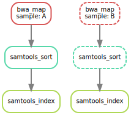
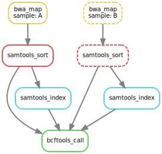
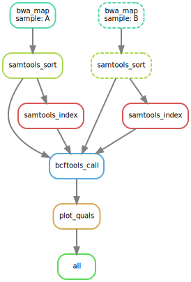
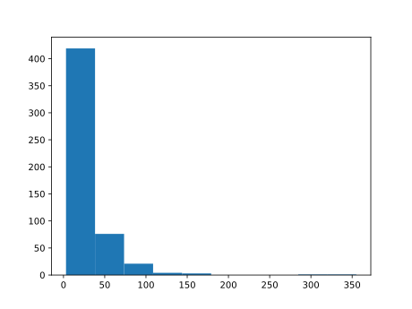

snakemake singularity
================
Sylvain Schmitt
April 8, 2021

  - [Summary](#summary)
  - [Setup](#setup)
      - [Requirements](#requirements)
      - [Data](#data)
      - [Conda](#conda)
      - [Singularity container](#singularity-container)
  - [Basics](#basics)
      - [Mapping reads](#mapping-reads)
      - [Generalizing the read mapping
        rule](#generalizing-the-read-mapping-rule)
      - [Sorting read alignments](#sorting-read-alignments)
      - [Indexing read alignments and visualizing the DAG of
        jobs](#indexing-read-alignments-and-visualizing-the-dag-of-jobs)
      - [Calling genomic variants](#calling-genomic-variants)
      - [Using custom scripts](#using-custom-scripts)
      - [Adding a target rule](#adding-a-target-rule)
  - [Advanced: Decorating the example
    workflow](#advanced-decorating-the-example-workflow)
      - [Specifying the number of used
        threads](#specifying-the-number-of-used-threads)
      - [Config files](#config-files)
      - [Input functions](#input-functions)
      - [Rule parameters](#rule-parameters)
      - [Logging](#logging)
      - [Temporary and protected files](#temporary-and-protected-files)
      - [Benchmarking](#benchmarking)
      - [Automatic deployment of software
        dependencies](#automatic-deployment-of-software-dependencies)
      - [Tool wrappers](#tool-wrappers)
      - [Constraining wildcards](#constraining-wildcards)
  - [Cluster](#cluster)

Test of the `snakemake`
[tutorial](https://snakemake.readthedocs.io/en/stable/tutorial/setup.html#running-the-tutorial-on-your-local-machine)
on my local machine. **Next step is to combine it with `singularity` as
[here](https://forgemia.inra.fr/umr-1202-biogeco/snakemake_singularity_hpc#test-example-).**

# Summary

*Everything is developed below.*

1.  Get data `wget
    https://github.com/snakemake/snakemake-tutorial-data/archive/v5.24.1.tar.gz`
2.  Create a environment file
    [`img/environment.yml`](img/environment.yml)

# Setup

## Requirements

  - [x]
    [Singularity](https://github.com/hpcng/singularity/blob/master/INSTALL.md)
  - [x] Python ≥3.5 `sudo apt-get install python3.5`
  - [x] Snakemake ≥5.24.1 `sudo apt install snakemake`
  - [x] BWA 0.7 `sudo apt-get install bwa`
  - [x] SAMtools 1.9 `sudo apt-get install samtools`
  - [x] Pysam 0.15 `pip install pysam`
  - [x] BCFtools 1.9 `sudo apt-get install bcftools`
  - [x] Graphviz 2.42 `pip install Graphviz`
  - [x] Jinja2 2.11 `pip install Jinja2`
  - [x] NetworkX 2.5 `pip install NetworkX`
  - [x] Matplotlib 3.3 `pip install Matplotlib`

<!-- ## Installing Mambaforge -->

<!-- ```{bash, eval=F, echo=T} -->

<!-- cd ~/Téléchargements -->

<!-- wget https://github.com/conda-forge/miniforge/releases/latest/download/Mambaforge-Linux-x86_64.sh -->

<!-- bash Mambaforge-Linux-x86_64.sh -->

<!-- ``` -->

## Data

``` bash
wget https://github.com/snakemake/snakemake-tutorial-data/archive/v5.24.1.tar.gz
tar --wildcards -xf v5.24.1.tar.gz --strip 1 "*/data" "*/environment.yaml"
rm *.tar.gz*
```

Vizualise obtained data.

``` bash
tree data
```

    data
    ├── genome.fa
    ├── genome.fa.amb
    ├── genome.fa.ann
    ├── genome.fa.bwt
    ├── genome.fa.fai
    ├── genome.fa.pac
    ├── genome.fa.sa
    └── samples
        ├── A.fastq
        ├── B.fastq
        └── C.fastq
    
    1 directory, 10 files

## Conda

Write `img/environment.yml`:

``` python
rule bwa_map:
    input:
        "data/genome.fa",
        "data/samples/A.fastq"
    output:
        "mapped_reads/A.bam"
    shell:
        "bwa mem {input} | samtools view -Sb - > {output}"
```

test:

``` bash
conda env create -n myEnv -f environment.yml
conda activate myEnv
conda env list
```

Useful commands list :

  - conda env create (with yml file)
  - conda activate
  - conda deactivate
  - conda remove –name myEnv –all (remove select environment)
  - conda create
  - conda list (package list)
  - conda env list (conda envs list)

When envs are created they are automatically create in the folder
/home/user/anaconda3/envs/ . You can change the path with the argument
–prefix, it can be useful if you want to create an environment
specific to a project. Useful links :
<https://docs.conda.io/projects/conda/en/latest/user-guide/tasks/manage-environments.html>

## Singularity container

Write `img/sing.def`:

``` python
Bootstrap : docker
From :  continuumio/miniconda3
IncludeCmd : yes

%files
environment.yml

%post
apt-get update && apt-get install -y procps && apt-get clean -y
/opt/conda/bin/conda env create -n myEnv -f /environment.yml 
/opt/conda/bin/conda clean -a


%environment
export PATH=/opt/conda/bin:$PATH
. /opt/conda/etc/profile.d/conda.sh
conda activate myEnv

%runscript
echo "Hello World"

%help
Tools for Snakemake tutorial

%labels
Author Sylvain SCHMITT
```

build:

``` bash
sudo singularity build snakemake_tuto.sif sing.def
```

<!-- ## Creating an environment with the required software -->

<!-- **Slow with bad internet connection!** -->

<!-- ```{bash, eval=F, echo=T} -->

<!-- conda activate base -->

<!-- mamba env create --name snakemake-tutorial --file environment.yaml -->

<!-- ``` -->

<!-- ## Activating the environment -->

<!-- ```{bash, eval=F} -->

<!-- conda activate snakemake-tutorial -->

<!-- snakemake --help -->

<!-- ``` -->

<!-- To stop it (not now): -->

<!-- ```{bash, eval=F} -->

<!-- conda deactivate -->

<!-- ``` -->

# Basics

## Mapping reads

Write `Snakefile`:

``` python
rule bwa_map:
    input:
        "data/genome.fa",
        "data/samples/A.fastq"
    output:
        "mapped_reads/A.bam"
    shell:
        "bwa mem {input} | samtools view -Sb - > {output}"
```

dry run:

``` bash
snakemake -np mapped_reads/A.bam
```

test:

``` bash
snakemake --cores 1 mapped_reads/A.bam
```

## Generalizing the read mapping rule

``` python
rule bwa_map:
    input:
        "data/genome.fa",
        "data/samples/{sample}.fastq"
    output:
        "mapped_reads/{sample}.bam"
    shell:
        "bwa mem {input} | samtools view -Sb - > {output}"
```

dry run:

``` bash
snakemake -np mapped_reads/B.bam
snakemake -np mapped_reads/A.bam mapped_reads/B.bam
snakemake -np mapped_reads/{A,B}.bam
```

`snakemake` is not producing `A.bam` as already done. Test the
follwongin and rerun dry run:

``` bash
touch data/samples/A.fastq
```

## Sorting read alignments

Add to `Snakefile`:

``` python
rule samtools_sort:
    input:
        "mapped_reads/{sample}.bam"
    output:
        "sorted_reads/{sample}.bam"
    shell:
        "samtools sort -T sorted_reads/{wildcards.sample} "
        "-O bam {input} > {output}"
```

dry run:

``` bash
snakemake -np sorted_reads/B.bam
```

## Indexing read alignments and visualizing the DAG of jobs

Add to `Snakefile`:

``` python
rule samtools_index:
    input:
        "sorted_reads/{sample}.bam"
    output:
        "sorted_reads/{sample}.bam.bai"
    shell:
        "samtools index {input}"
```

see dag:

``` bash
snakemake --dag sorted_reads/{A,B}.bam.bai | dot -Tsvg > dag/dag1.svg
```

``` r

```

<!-- -->

*Dashed frames are already done.*

## Calling genomic variants

Add to top of `Snakefile`:

``` python
SAMPLES = ["A", "B"]
```

Add to `Snakefile`:

``` python
rule bcftools_call:
    input:
        fa="data/genome.fa",
        bam=expand("sorted_reads/{sample}.bam", sample=SAMPLES),
        bai=expand("sorted_reads/{sample}.bam.bai", sample=SAMPLES)
    output:
        "calls/all.vcf"
    shell:
        "samtools mpileup -g -f {input.fa} {input.bam} | "
        "bcftools call -mv - > {output}"
```

``` bash
snakemake --dag calls/all.vcf | dot -Tsvg > dag/dag2.svg
```

``` r

```

<!-- -->

## Using custom scripts

Add to `Snakefile`:

``` python
rule plot_quals:
    input:
        "calls/all.vcf"
    output:
        "plots/quals.svg"
    script:
        "scripts/plot-quals.py"
```

Write `scripts/plots-qual.py`:

``` python
import matplotlib
matplotlib.use("Agg")
import matplotlib.pyplot as plt
from pysam import VariantFile

quals = [record.qual for record in VariantFile(snakemake.input[0])]
plt.hist(quals)

plt.savefig(snakemake.output[0])
```

It is also possible with R using `snakemake@input[[1]]`. See this
\[page\]’<https://snakemake.readthedocs.io/en/stable/snakefiles/rules.html#snakefiles-external-scripts>)
for automatic Rmd report.

## Adding a target rule

Add to top of `Snakefile`:

``` python
rule all:
    input:
        "plots/quals.svg"
```

dry run:

``` bash
snakemake -n
```

dag:

``` bash
snakemake --dag | dot -Tsvg > dag/dagAll.svg
```

``` r

```

<!-- -->

run:

``` bash
snakemake --cores 4
```

``` r

```

<!-- -->

# Advanced: Decorating the example workflow

## Specifying the number of used threads

Change `Snakefile`:

``` python
rule bwa_map:
    input:
        "data/genome.fa",
        "data/samples/{sample}.fastq"
    output:
        "mapped_reads/{sample}.bam"
    threads: 8
    shell:
        "bwa mem -t {threads} {input} | samtools view -Sb - > {output}"
```

## Config files

Add to top of `Snakefile`:

``` python
configfile: "config.yaml"
```

Write `config.yml`:

``` python
samples:
    A: data/samples/A.fastq
    B: data/samples/B.fastq
```

Change `Snakefile`:

``` python
rule bcftools_call:
    input:
        fa="data/genome.fa",
        bam=expand("sorted_reads/{sample}.bam", sample=config["samples"]),
        bai=expand("sorted_reads/{sample}.bam.bai", sample=config["samples"])
    output:
        "calls/all.vcf"
    shell:
        "samtools mpileup -g -f {input.fa} {input.bam} | "
        "bcftools call -mv - > {output}"
```

## Input functions

Change `Snakefile`:

``` python
def get_bwa_map_input_fastqs(wildcards):
    return config["samples"][wildcards.sample]
    
rule bwa_map:
    input:
        "data/genome.fa",
        get_bwa_map_input_fastqs
    output:
        "mapped_reads/{sample}.bam"
    threads: 8
    shell:
        "bwa mem -t {threads} {input} | samtools view -Sb - > {output}"
```

## Rule parameters

Change `Snakefile`:

``` python
rule bwa_map:
    input:
        "data/genome.fa",
        lambda wildcards: config["samples"][wildcards.sample]
    output:
        "mapped_reads/{sample}.bam"
    params:
        rg=r"@RG\tID:{sample}\tSM:{sample}"
    threads: 8
    shell:
        "bwa mem -R '{params.rg}' -t {threads} {input} | samtools view -Sb - > {output}"
```

## Logging

Change `Snakefile`:

``` python
rule bwa_map:
    input:
        "data/genome.fa",
        get_bwa_map_input_fastqs
    output:
        "mapped_reads/{sample}.bam"
    params:
        rg=r"@RG\tID:{sample}\tSM:{sample}"
    log:
        "logs/bwa_mem/{sample}.log"
    threads: 8
    shell:
        "(bwa mem -R '{params.rg}' -t {threads} {input} | "
        "samtools view -Sb - > {output}) 2> {log}"
```

## Temporary and protected files

Change `Snakefile`:

``` python
rule bwa_map:
    input:
        "data/genome.fa",
        get_bwa_map_input_fastqs
    output:
        temp("mapped_reads/{sample}.bam")
    params:
        rg=r"@RG\tID:{sample}\tSM:{sample}"
    log:
        "logs/bwa_mem/{sample}.log"
    threads: 8
    shell:
        "(bwa mem -R '{params.rg}' -t {threads} {input} | "
        "samtools view -Sb - > {output}) 2> {log}"
```

Change `Snakefile`:

``` python
rule samtools_sort:
    input:
        "mapped_reads/{sample}.bam"
    output:
        protected("sorted_reads/{sample}.bam")
    shell:
        "samtools sort -T sorted_reads/{wildcards.sample} "
        "-O bam {input} > {output}"
```

## Benchmarking

Change `Snakefile`:

``` python
rule bwa_map:
    input:
        "data/genome.fa",
        lambda wildcards: config["samples"][wildcards.sample]
    output:
        temp("mapped_reads/{sample}.bam")
    params:
        rg="@RG\tID:{sample}\tSM:{sample}"
    log:
        "logs/bwa_mem/{sample}.log"
    benchmark:
        "benchmarks/{sample}.bwa.benchmark.txt"
    threads: 8
    shell:
        "(bwa mem -R '{params.rg}' -t {threads} {input} | "
        "samtools view -Sb - > {output}) 2> {log}"
```

## Automatic deployment of software dependencies

*Not tested.*

Change `Snakefile`:

``` python
rule bwa_map:
    input:
        "data/genome.fa",
        lambda wildcards: config["samples"][wildcards.sample]
    output:
        temp("mapped_reads/{sample}.bam")
    params:
        rg="@RG\tID:{sample}\tSM:{sample}"
    log:
        "logs/bwa_mem/{sample}.log"
    benchmark:
        "benchmarks/{sample}.bwa.benchmark.txt"
    threads: 8
    shell:
        "(bwa mem -R '{params.rg}' -t {threads} {input} | "
        "samtools view -Sb - > {output}) 2> {log}"
```

Add `envs/samtools.yaml`:

``` python
channels:
  - bioconda
  - conda-forge
dependencies:
  - samtools =1.9
```

run:

``` bash
snakemake --use-conda --cores 1
```

## Tool wrappers

Some tools have wrapper to avoid writing the shell command, *e.g.*:

``` python
rule bwa_mem:
  input:
      ref="data/genome.fa",
      sample=lambda wildcards: config["samples"][wildcards.sample]
  output:
      temp("mapped_reads/{sample}.bam")
  log:
      "logs/bwa_mem/{sample}.log"
  params:
      "-R '@RG\tID:{sample}\tSM:{sample}'"
  threads: 8
  wrapper:
      "0.15.3/bio/bwa/mem"
```

## Constraining wildcards

Regular expressions can be used, *e.g.*:
`"sorted_reads/{sample,[A-Za-z0-9]+}.bam"`.

# Cluster

[Newt version for
genotoul](https://forgemia.inra.fr/umr-1202-biogeco/snakemake_singularity_hpc#bash)
